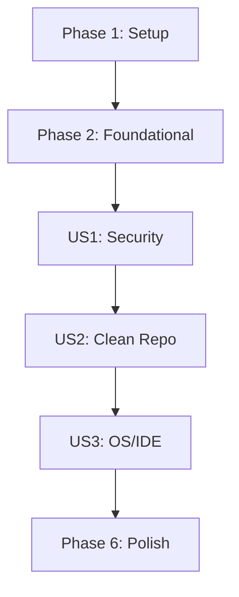

# Tasks: Secure Gitignore Configuration

**Feature**: Secure Gitignore Configuration
**Plan**: [plan.md](./plan.md)
**Status**: Completed

## Implementation Strategy

We will implement the secure `.gitignore` configuration incrementally, prioritizing security-critical patterns (secrets and keys) first. The implementation follows a "deny-by-default" strategy for sensitive patterns and uses standardized sections as defined in the contract. Each phase results in an independently testable improvement to the repository's security and cleanliness.

## Phase 1: Setup

- [X] T001 Backup existing .gitignore file to .gitignore.bak
- [X] T002 Initialize new .gitignore with header and encoding (UTF-8, LF) in .gitignore

## Phase 2: Foundational

- [X] T003 [P] Add general project exclusion rules (e.g., !.gitkeep) in .gitignore

## Phase 3: [US1] Prevent Sensitive Data Exposure (Priority: P1)

**Goal**: Ensure all credentials, API keys, and environment variables are ignored.
**Independent Test**: Create a dummy `.env` and `test.key` file; verify `git status` does not track them.

- [X] T004 [US1] Create "# Security & Secrets" section with .env* pattern in .gitignore
- [X] T005 [P] [US1] Add patterns for private keys and certificates (*.key, *.pem, *.p12) in .gitignore
- [X] T006 [P] [US1] Add patterns for local secret stores (secrets.json, .credentials/) in .gitignore

## Phase 4: [US2] Maintain Clean Repository (Priority: P2)

**Goal**: Exclude build artifacts, dependencies, and temporary runtime files.
**Independent Test**: Run a build command; verify `dist/` and `node_modules/` are not tracked.

- [X] T007 [US2] Create "# Dependencies" section with node_modules/ and lock files in .gitignore
- [X] T008 [P] [US2] Create "# Build Outputs" section with dist/, build/, and out/ patterns in .gitignore
- [X] T009 [P] [US2] Create "# Logs & Debugging" section with *.log and debug logs in .gitignore
- [X] T010 [P] [US2] Add Supabase local dev artifacts (.supabase/functions/.import_map.json) in .gitignore

## Phase 5: [US3] OS & IDE Independence (Priority: P3)

**Goal**: Ignore system-specific and editor-specific metadata.
**Independent Test**: Create `.DS_Store` and `.vscode/` folder; verify they are ignored.

- [X] T011 [US3] Create "# OS Specifics" section with .DS_Store, Thumbs.db, and desktop.ini in .gitignore
- [X] T012 [P] [US3] Create "# IDE Specifics" section for VS Code (.vscode/), IntelliJ (.idea/), and Vim (*.swp) in .gitignore
- [X] T013 [P] [US3] Create "# Local Databases" section with *.db and *.sqlite patterns in .gitignore

## Phase 6: Polish & Verification

- [X] T014 Run `git clean -ndX` to verify all expected files are being ignored correctly
- [X] T015 Identify and untrack any files that were previously committed but should now be ignored using `git rm --cached`
- [X] T016 Final review of .gitignore formatting and section headers in .gitignore
- [X] T017 Remove .gitignore.bak after successful verification

## Dependencies

## Parallel Execution Examples

### User Story 1: Security (Phase 3)
- T005 and T006 can be executed in parallel after T004 is completed.

### User Story 2: Clean Repo (Phase 4)
- T008, T009, and T010 can be executed in parallel after T007 is completed.

### User Story 3: OS/IDE (Phase 5)
- T012 and T013 can be executed in parallel after T011 is completed.
