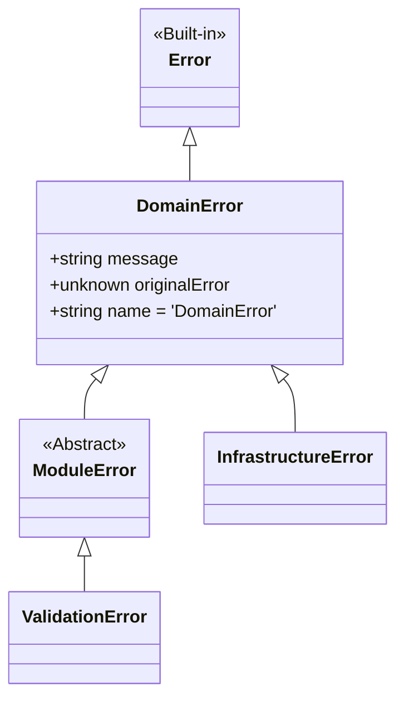

# Data Model: Entity Alignment & Refactoring

**Feature**: Codebase Refactoring and Cleanup (008)

## Error Entity Hierarchy

The refactoring will align all domain errors with the central base class to ensure consistent propagation and catching at the adapter boundaries.

### Refactored Entities

| Module | Entity | Changes |
|--------|--------|---------|
| `core` | `DomainError` | Becomes the canonical base for all domain-specific errors. |
| `transactions` | `TransactionError` | Will now extend `src/core/errors/DomainError` instead of a local redefinition. |
| `shared` | `BigIntAdapter` | Internal state simplified; pure functional approach for parsing. |

## Storage Interface Consolidation

Internal interfaces used only within repositories will be marked as private or moved to a specialized `infrastructure/storage/types/internal.ts` if they clutter the public API.

| File | Interface | Action |
|------|-----------|--------|
| `VaultDatabase.ts` | `ILocalPayee` | Scope restricted to the database module. |
| `VaultDatabase.ts` | `ISyncMetadata` | Moved to `shared/domain` if used by Core, otherwise restricted. |
